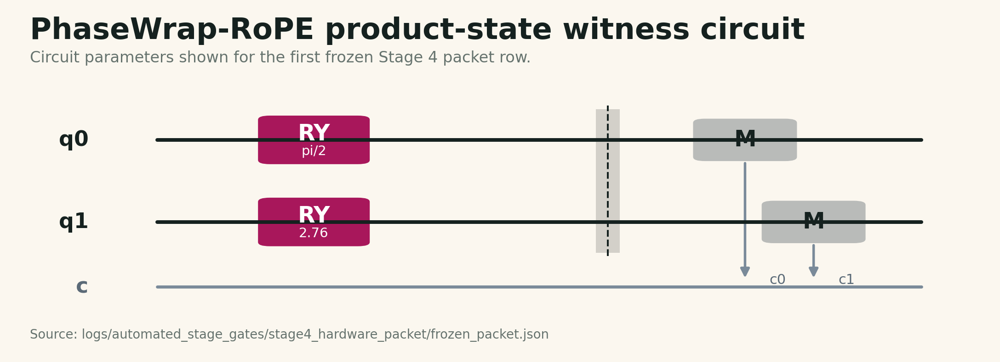
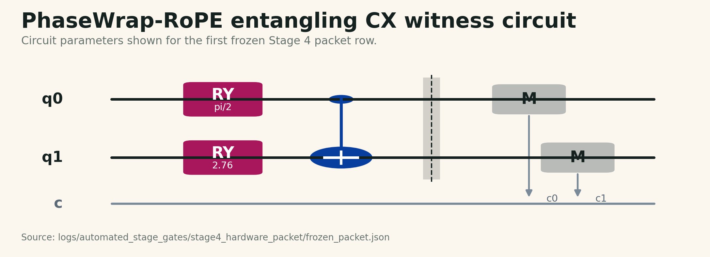
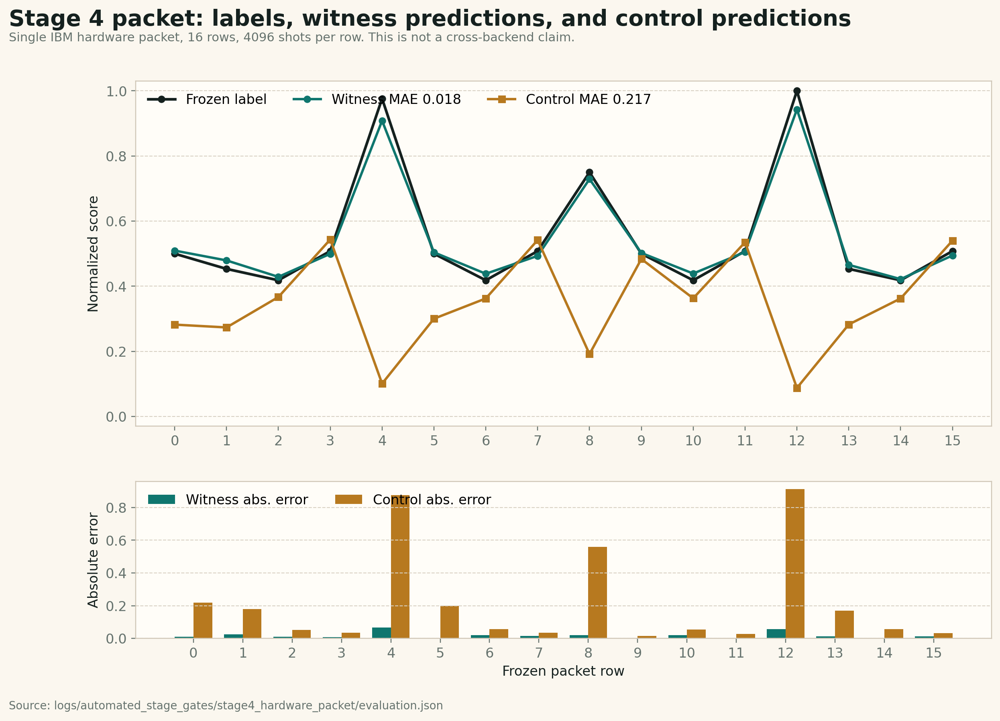
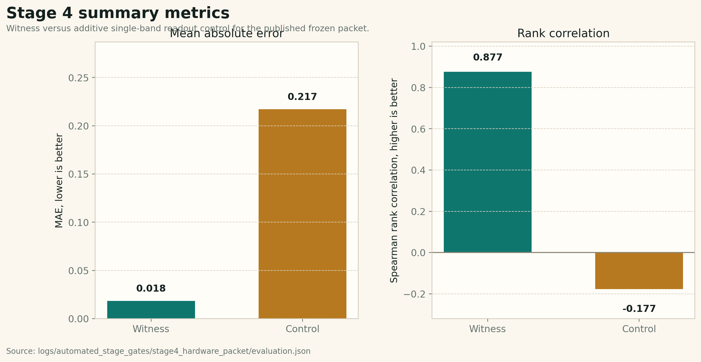
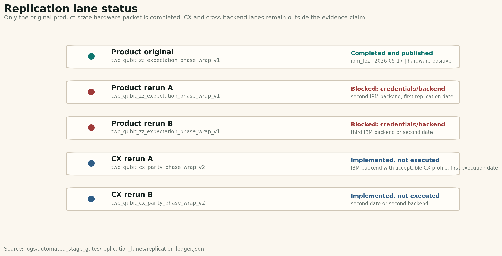

# PhaseWrap-RoPE: Phase-Wrapped Rotary Positional Scoring with Reproducible Quantum Hardware Validation

## Abstract

PhaseWrap-RoPE is a phase-wrap positional-scoring method that represents offset relationships through modular residuals. The method computes wrapped residuals in two periods, converts each residual into a signed cosine margin, and combines the margins into an SQR score. This paper defines the PhaseWrap-RoPE score, describes the two-qubit hardware witness used for the current release, and reports a reproducible Stage 4 execution on IBM Quantum hardware.

In the released Stage 4 packet, a cross-band witness computed from the measured \(E[Z_0 Z_1]\) expectation tracks the frozen PhaseWrap-RoPE labels more closely than an additive single-band control. The recorded 16-row hardware packet reports witness MAE \(0.018382\) and rank correlation \(0.876558\), compared with control MAE \(0.217262\) and rank correlation \(-0.176940\). The contribution of this release is both methodological and evidentiary: PhaseWrap-RoPE supplies a compact phase-wrap scoring rule, a deterministic packet-based validation workflow, and raw-count hardware artifacts that can be recomputed offline.

## Keywords

Phase-wrapped rotary positional encoding; quantum hardware validation; phase-wrap scoring; modular residuals; quantum circuit validation; deterministic evidence packets; IBM Quantum hardware.

## 1. Definitions and notation

This section defines the main terms used throughout the paper.

| Term | Meaning in this paper |
|---|---|
| Position offset | An integer displacement, denoted \(\delta\), used to compare two positions or position-derived features. |
| Period \(P\) | A modular basis used to wrap offsets. This release uses \(P=8\) and \(P=12\). |
| Phase | The angular representation \(2\pi\delta/P\) of an offset under period \(P\). |
| Phase wrap | The operation that shifts an angle by integer multiples of \(2\pi\) into \((-\pi,\pi]\). |
| Wrapped residual | The absolute wrapped difference between two period-specific phases. It measures phase distance after modular wraparound. |
| Band | One of the two modular channels used by PhaseWrap-RoPE. The current score uses an 8-period band and a 12-period band. |
| Signed margin | A cosine residual shifted by a one-step threshold. A positive margin means the residual is inside the one-step boundary; a negative margin means it is outside. |
| SQR score | The local PhaseWrap-RoPE score, computed as the product of the period-8 and period-12 signed margins. |
| Normalized label | A clamped value in \([0,1]\) derived from the SQR score over the fixed packet grid. |
| Witness | The hardware-derived prediction used to test the cross-band PhaseWrap-RoPE score. In the current packet, it is derived from \(E[Z_0 Z_1]\). |
| Control | The additive single-band baseline used for comparison against the witness. |
| Shot | One circuit execution and measurement sample. The Stage 4 packet uses 4096 shots per row. |
| Raw counts | The measured bitstring counts returned by hardware, such as counts for `00`, `01`, `10`, and `11`. |
| \(E[Z_i]\) | The Pauli-Z expectation for qubit \(i\), with measurement outcome `0` mapped to \(+1\) and `1` mapped to \(-1\). |
| \(E[Z_0 Z_1]\) | The two-qubit parity expectation, with equal measured bits contributing \(+1\) and unequal bits contributing \(-1\). |
| Frozen packet | A fixed set of input rows, labels, execution settings, and identifiers used before hardware execution. |
| Backend | The named hardware target used for execution. The Stage 4 packet was executed on `ibm_fez`. |
| Offline verifier | A script that recomputes reported metrics from saved packet files, raw counts, and metadata. |
| MAE | Mean absolute error between hardware-derived predictions and frozen labels. |
| Rank correlation | The evaluator's monotonic-order agreement metric between predictions and labels. |

## 2. Introduction

Positional encodings give attention models access to token order. The Transformer architecture established self-attention as a general sequence-modeling foundation [1]. Rotary Position Embedding (RoPE) later introduced a rotation-based way to encode position while preserving useful relative-position structure in self-attention [2].

PhaseWrap-RoPE develops a related phase idea in a narrower and more directly testable form. Instead of beginning with a full transformer implementation, PhaseWrap-RoPE defines a local phase-wrap score over integer offsets and validates that score through fixed software and hardware artifacts. The resulting workflow is designed so that a reviewer can inspect the score definition, inspect the frozen packet, recompute the metrics, and compare the cross-band witness against a control condition.

The paper makes three contributions:

1. It defines a phase-wrap positional score based on period-8 and period-12 signed margins.
2. It describes a deterministic validation workflow built around frozen packets, fixed shot counts, raw measurement counts, backend metadata, and offline recomputation.
3. It reports a Stage 4 hardware execution in which the cross-band witness outperforms the additive control on the frozen packet.

## 3. Relationship to RoPE and positional encoding

RoPE uses rotations to incorporate positional information into transformer self-attention and to express relative-position dependencies [2]. PhaseWrap-RoPE keeps the phase-centered intuition but changes the object of study. The present method is a local positional-scoring rule, not a complete transformer positional-embedding layer.

The relationship is therefore conceptual: both RoPE and PhaseWrap-RoPE use angular structure, but PhaseWrap-RoPE focuses on wrapped residuals across two modular periods and combines them through a signed product score. This makes the current PhaseWrap-RoPE release suitable for packet-based validation before broader architecture-level experiments.

## 4. PhaseWrap-RoPE score definition


**Figure 1.** PhaseWrap-RoPE phase-wrap scoring schematic. The figure is conceptual; the formulas below define the method.

For integer offsets \(\delta_a\) and \(\delta_b\), define the period-specific wrapped phase as

```text
wrap_pi(x) = x shifted by integer multiples of 2*pi into (-pi, pi]

theta_P(delta) = wrap_pi(2*pi*delta/P)

r_P(delta_a, delta_b) = abs(wrap_pi(theta_P(delta_a) - theta_P(delta_b)))
```

The current PhaseWrap-RoPE release uses two residuals:

```text
r8  = r_8(delta_a, delta_b)
r12 = r_12(delta_a, delta_b)
```

Each residual is converted into a signed cosine margin:

```text
m8  = cos(r8)  - cos(pi/4)
m12 = cos(r12) - cos(pi/6)
```

The local PhaseWrap-RoPE score is the product of the two margins:

```text
SQR = m8 * m12
```

The thresholds correspond to one modular step in each band. For period 8, one step is \(2\pi/8=\pi/4\). For period 12, one step is \(2\pi/12=\pi/6\). Subtracting these cosine thresholds centers each margin at its one-step residual boundary: margins are positive below that boundary, approximately zero at the boundary, and negative beyond it.

For packet labels, the implementation normalizes the score by clamping:

```text
label = clamp(0.5 + 0.5 * SQR / MAX_ABS_SCORE, 0, 1)
```

where `MAX_ABS_SCORE` is computed over the fixed delta grid used by the packet generator.

### Algorithm 1. Local PhaseWrap-RoPE score

```text
Input: integer offsets delta_a, delta_b
Output: signed score SQR and normalized label

for P in {8, 12}:
    theta_a[P] = wrap_pi(2*pi*delta_a/P)
    theta_b[P] = wrap_pi(2*pi*delta_b/P)
    r[P] = abs(wrap_pi(theta_a[P] - theta_b[P]))

m8 = cos(r[8]) - cos(pi/4)
m12 = cos(r[12]) - cos(pi/6)
SQR = m8 * m12
label = clamp(0.5 + 0.5*SQR/MAX_ABS_SCORE, 0, 1)
```

## 5. Hardware witness

The current Stage 4 packet uses the `two_qubit_zz_expectation_phase_wrap_v1` circuit family. The circuit maps the two signed margins into normalized Pauli-Z targets:

```text
z0 = clamp(m8 / MAX_ABS_M8, -1, 1)
z1 = clamp(m12 / MAX_ABS_M12, -1, 1)
theta_0 = arccos(z0)
theta_1 = arccos(z1)
```

Each qubit is prepared with a Y-axis rotation using the corresponding angle, measured in the computational basis, and converted into \(E[Z_0]\), \(E[Z_1]\), and \(E[Z_0 Z_1]\). The witness prediction uses the cross-band product readout:

```text
witness = clamp(0.5 + 0.5 * score_scale * E[Z0 Z1], 0, 1)
```

The control prediction uses the additive single-band readout:

```text
control = clamp(0.5 + 0.25 * (E[Z0] + E[Z1]), 0, 1)
```



**Figure 2.** Product-state witness circuit for the published Stage 4 hardware packet. The rendered parameters are taken from the first frozen packet row.

The Stage 4 circuit is a product-state angle-encoding/readout witness. It contains no entangling gate. The measured \(E[Z_0 Z_1]\) term is therefore a hardware readout of the cross-band product induced by independently encoded margins.

The repository also includes an entangling CX witness family for follow-up execution:

```text
two_qubit_cx_parity_phase_wrap_v2
```

This variant applies `CX(q0 -> q1)` after the two `RY` margin encodings. In the ideal circuit, the target-qubit Z expectation after CX carries the cross-band parity/product signal. The corresponding witness and control scores are:

```text
witness_cx = clamp(0.5 + 0.5 * score_scale * E[Z1 after CX], 0, 1)
control_cx = clamp(0.5 + 0.25 * (E[Z0 after CX] + E[Z0 Z1 after CX]), 0, 1)
```



**Figure 3.** Entangling CX witness variant implemented for follow-up hardware execution.

Implementation reference: `src/qrope/automated_stage_gates.py`.

## 6. Validation workflow


**Figure 4.** Deterministic validation workflow. The verifier recomputes metrics from frozen packet files and execution records.

The validation workflow is packet-based. A packet fixes the rows, labels, shot count, circuit family, backend target, and identifiers before evaluation. The hardware run then produces raw measurement counts, which are saved with execution metadata and processed by the evaluator.

A reviewable evidence packet should include:

- frozen input rows;
- fixed row count;
- fixed shot count;
- raw measurement counts;
- backend metadata;
- packet identifier;
- offline verifier;
- deterministic pass/fail or status outcome.

For the Stage 4 packet, the verifier entry point is:

```bash
python scripts/verify_stage4_hardware_packet.py
```

The default verifier inputs are:

- `logs/automated_stage_gates/stage4_hardware_packet/frozen_packet.json`
- `logs/automated_stage_gates/stage4_hardware_packet/execution.json`
- `logs/automated_stage_gates/stage4_hardware_packet/evaluation.json`
- `logs/automated_stage_gates/stage4_hardware_packet/summary.json`

The default verifier output is:

- `logs/automated_stage_gates/stage4_hardware_packet/offline_verification.json`

IBM Quantum Runtime primitives provide the execution model used by the hardware workflow. IBM's documentation describes Qiskit Runtime primitives, including EstimatorV2 and SamplerV2, as cloud-service implementations used to access IBM Quantum hardware [3]. The SamplerV2 API is the relevant primitive for sampled circuit output registers [4]. IBM's backend documentation describes how backend properties, supported instructions, and calibration-related device details are inspected [5].

## 7. Stage 4 hardware result



**Figure 5.** Stage 4 row-level labels, witness predictions, control predictions, and absolute errors. Source data: `logs/automated_stage_gates/stage4_hardware_packet/evaluation.json`.



**Figure 6.** Stage 4 witness versus control summary metrics. Source data: `logs/automated_stage_gates/stage4_hardware_packet/evaluation.json`.



**Figure 7.** Replication lane status. Source data: `logs/automated_stage_gates/replication_lanes/replication-ledger.json`.

The released Stage 4 packet records the following execution conditions and metrics:

| Field | Value |
|---|---|
| Provider | `ibm_runtime` |
| Backend | `ibm_fez` |
| Job id | `d84jbq00bvlc73d4krr0` |
| Submitted at | `2026-05-17T03:28:38Z` |
| Completed at | `2026-05-17T03:29:05Z` |
| Calibration metadata captured at | `2026-05-17T03:29:05Z` |
| Calibration last update | `2026-05-16 20:02:17-07:00` |
| Backend qubit count in captured metadata | `156` |
| Packet id | `qrope-hardware-73c61893576297ff` |
| Rows | `16` |
| Shots per row | `4096` |
| Witness MAE | `0.018382` |
| Witness rank correlation | `0.876558` |
| Control MAE | `0.217262` |
| Control rank correlation | `-0.176940` |
| Outcome | `hardware-positive` |

The witness condition substantially improves over the additive control on this packet. The row-level results show that the cross-band product readout tracks the frozen labels, while the additive control collapses much of the score structure. The result demonstrates that the PhaseWrap-RoPE score, packet generator, hardware readout, and offline verifier form a coherent reproducible validation loop for this Stage 4 execution.

## 8. Reproducibility artifacts

The minimum review path is:

1. Inspect `docs/research/q-rope-phase-wrap-qrope-algorithm-v1.md`.
2. Inspect `docs/research/q-rope-stage4-real-hardware-validation-result-v1.md`.
3. Run or inspect `scripts/verify_stage4_hardware_packet.py`.
4. Compare the verifier output with `logs/automated_stage_gates/stage4_hardware_packet/offline_verification.json`.

The review standard is traceability: the reported numbers should be reproducible from packet files, execution records, raw counts, and deterministic recomputation.

## 9. Scope and next experiments

The current release establishes a method definition and one saved hardware-positive packet. The next experiments are straightforward:

- execute the entangling CX witness on hardware and publish the same raw-count evidence record;
- rerun the frozen packet across additional dates and backends;
- vary packet composition and row count;
- compare simulator, noisy-simulator, and hardware behavior under controlled settings;
- test whether PhaseWrap-RoPE-style features are useful inside transformer-adjacent models.

These experiments would turn the current packet-level result into a broader empirical study.

## 10. Availability, license, and patent notice

The QRoPE repository contains the PhaseWrap-RoPE method implementation, verifier, evidence packet, figures, and publication materials. Repository filenames and artifact identifiers may retain `qrope` for continuity. The repository software is released under `AGPL-3.0-only`. PhaseWrap-RoPE is patent pending under U.S. provisional patent application `64/068,121`. Commercial patent licensing, non-AGPL use, assignments, and sublicensing should be handled separately with Quantyra/CYINT IP.

## 11. Conclusion

PhaseWrap-RoPE defines a compact phase-wrap positional score based on two modular signed margins. The current hardware packet shows that a two-qubit cross-band witness can reproduce the frozen PhaseWrap-RoPE labels more accurately than an additive single-band control under the recorded Stage 4 conditions. More importantly, the release provides a transparent validation workflow: fixed packet, fixed shot count, raw counts, backend metadata, deterministic evaluator, and offline verifier. This makes PhaseWrap-RoPE suitable for external review and for systematic follow-up experiments.

## Repository evidence references

- `src/qrope/automated_stage_gates.py`
- `scripts/verify_stage4_hardware_packet.py`
- `logs/automated_stage_gates/stage4_hardware_packet/frozen_packet.json`
- `logs/automated_stage_gates/stage4_hardware_packet/execution.json`
- `logs/automated_stage_gates/stage4_hardware_packet/evaluation.json`
- `logs/automated_stage_gates/stage4_hardware_packet/offline_verification.json`
- `docs/research/q-rope-phase-wrap-qrope-algorithm-v1.md`
- `docs/research/q-rope-stage4-real-hardware-validation-result-v1.md`
- `docs/publication/figures/qrope-method-schematic-v1.svg`
- `docs/publication/figures/qrope-product-state-circuit-v1.png`
- `docs/publication/figures/qrope-cx-witness-circuit-v1.png`
- `docs/publication/figures/qrope-validation-pipeline-v1.svg`
- `docs/publication/figures/qrope-stage4-predictions-v1.png`
- `docs/publication/figures/qrope-stage4-metrics-v1.png`
- `docs/publication/figures/qrope-replication-status-v1.png`
- `docs/publication/replication-ledger-v1.md`
- `logs/automated_stage_gates/replication_lanes/replication-ledger.json`
- `PATENTS.md`
- `README.md`

## References

[1] Ashish Vaswani, Noam Shazeer, Niki Parmar, Jakob Uszkoreit, Llion Jones, Aidan N. Gomez, Lukasz Kaiser, and Illia Polosukhin. "Attention Is All You Need." arXiv:1706.03762, 2017. https://doi.org/10.48550/arXiv.1706.03762

[2] Jianlin Su, Yu Lu, Shengfeng Pan, Ahmed Murtadha, Bo Wen, and Yunfeng Liu. "RoFormer: Enhanced Transformer with Rotary Position Embedding." arXiv:2104.09864, 2021. https://doi.org/10.48550/arXiv.2104.09864

[3] IBM Quantum Documentation. "Introduction to primitives." Accessed 2026-05-18. https://quantum.cloud.ibm.com/docs/guides/qiskit-runtime-primitives

[4] IBM Quantum Documentation. "SamplerV2." Accessed 2026-05-18. https://quantum.cloud.ibm.com/docs/api/qiskit-ibm-runtime/sampler-v2

[5] IBM Quantum Documentation. "View backend details." Accessed 2026-05-18. https://quantum.cloud.ibm.com/docs/guides/qpu-information
