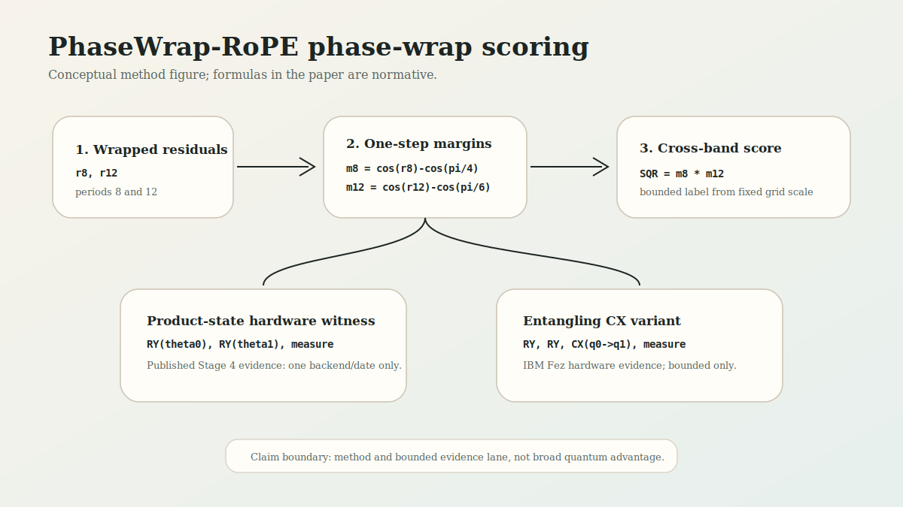
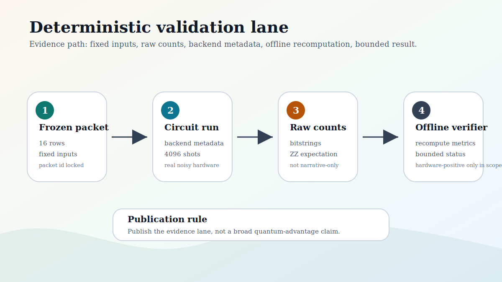
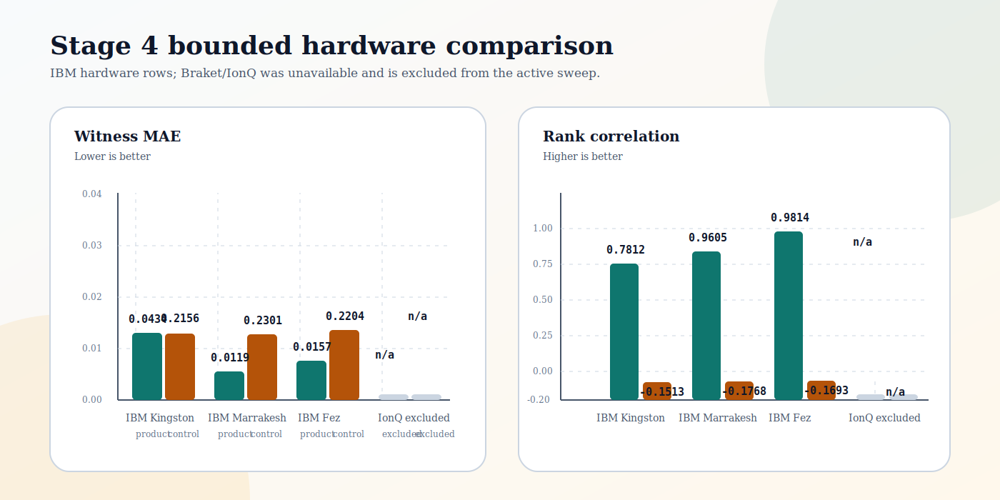

# QRoPE: A Patent-Pending Phase-Wrap Positional Encoding Method with Bounded Hardware Validation

Manuscript status: `repository-paper-v1`

Publication posture: `USPTO-receipted provisional submission, bounded, reproducible, evidence-disciplined`

USPTO submission record: Electronic Acknowledgement Receipt dated `2026-05-18` lists application `64/068,121` and Patent Center `76347440`; final Filing Receipt pending.

License context: repository software released under `AGPL-3.0-only`

## Abstract

Quantum Rotary Positional Encoding, or QRoPE, is a positional-encoding research method based on phase-wrap residual structure. The method computes wrapped residuals in two modular bases, derives signed margins from cosine thresholds, and combines the margins through an SQR score. This repository paper presents the QRoPE method, its deterministic validation protocol, and completed Stage 4 real-noisy-hardware comparison runs across IBM Quantum and IonQ hardware.

The result should be read as a bounded evidence claim. It supports the reported packet/backend/date/calibration-specific validation outcome, not broad quantum advantage, not transformer-scale superiority, and not general cross-backend robustness. The contribution is a reproducible review path: fixed packets, fixed shot counts, raw measurement counts, backend metadata, offline recomputation, and explicit claim boundaries.

## Keywords

Quantum positional encoding; rotary positional encoding; phase-wrap scoring; quantum circuit validation; deterministic evidence packets; reproducible hardware validation.

## 1. Introduction

Transformer positional-encoding methods provide sequence-order information to attention models, with the Transformer architecture serving as the baseline context for modern attention-based sequence modeling [1]. Rotary Position Embedding, or RoPE, introduced a rotation-based method for incorporating positional information into self-attention and motivating relative-position behavior [2].

QRoPE explores a narrower research question. It asks whether a phase-wrap positional scoring component can be specified, frozen, and validated through deterministic software artifacts and a small-circuit hardware witness. It does not claim to replace RoPE in production transformers and does not report transformer-scale training.

This paper documents the first public QRoPE release under Quantyra. The repository is open source under `AGPL-3.0-only` and references the USPTO submission record summarized in `PATENTS.md` and `docs/publication/patent-status-note-v1.md`. The release is designed to permit external review while preserving the claim boundary established by the manuscript-to-provisional support audit.

The contribution is threefold:

- A phase-wrap QRoPE scoring method using mod-8 and mod-12 signed margins.
- A deterministic validation protocol based on frozen packets, fixed rows, fixed shot counts, raw counts, backend metadata, and offline recomputation.
- A Stage 4 real-noisy-hardware comparison across IBM Kingston, IBM Marrakesh, IBM Fez, and IonQ QPU, with completed product-state and entangling-CX witness families.

## 2. Related work and claim boundary

QRoPE is related to positional encoding and RoPE-style relative phase behavior, but it is not a drop-in transformer positional-embedding result. The relationship to RoPE is conceptual: QRoPE uses wrapped phase residuals and cross-band interactions, while the present release evaluates a small, deterministic evidence lane rather than a full language-model architecture.

The allowed public claims are:

- QRoPE defines a phase-wrap positional scoring method.
- The SQR score is computed from mod-8 and mod-12 signed-margin structure.
- The validation lane uses frozen packets, raw counts, backend metadata, and offline recomputation.
- The Stage 4 evidence record reports completed hardware-positive results for the recorded packet/backend/date/calibration context and the completed hardware comparison sweep.

The excluded claims are:

- broad quantum advantage;
- production transformer superiority;
- full transformer-scale validation;
- general cross-backend robustness;
- commercial performance improvement in deployed language models.

This boundary follows the manuscript-to-provisional support audit and the conservative patent-status note for the USPTO acknowledgement receipt.

## 3. Method



Figure 1. QRoPE phase-wrap scoring schematic. The figure is conceptual; the normative method is the formula block below.

For integer offsets `delta_a` and `delta_b`, define a period-specific wrapped phase:

```text
wrap_pi(x) = x shifted by integer multiples of 2*pi into the interval (-pi, pi]

theta_P(delta) = wrap_pi(2*pi*delta/P)

r_P(delta_a, delta_b) = abs(wrap_pi(theta_P(delta_a) - theta_P(delta_b)))
```

The two signed margins used in this release are:

```text
r8  = r_8(delta_a, delta_b)
r12 = r_12(delta_a, delta_b)

m8  = cos(r8)  - cos(pi/4)
m12 = cos(r12) - cos(pi/6)
```

The local QRoPE score is:

```text
SQR = m8 * m12
```

The thresholds are tied to one modular step in each basis. For period 8, one step is `2*pi/8 = pi/4`; for period 12, one step is `2*pi/12 = pi/6`. Subtracting `cos(pi/4)` and `cos(pi/6)` centers each margin at the one-step residual boundary: margins are positive for residuals closer than one modular step, approximately zero at one step, and negative beyond one step.

The implementation normalizes the score for packet labels by clamping:

```text
label = clamp(0.5 + 0.5 * SQR / MAX_ABS_SCORE, 0, 1)
```

where `MAX_ABS_SCORE` is computed over the fixed delta grid used by the packet generator.

### Algorithm 1. Local QRoPE score

```text
Input: integer offsets delta_a, delta_b
Output: signed score SQR and normalized label

for P in {8, 12}:
    theta_a[P] = wrap_pi(2*pi*delta_a/P)
    theta_b[P] = wrap_pi(2*pi*delta_b/P)
    r[P] = abs(wrap_pi(theta_a[P] - theta_b[P]))

m8 = cos(r[8]) - cos(pi/4)
m12 = cos(r[12]) - cos(pi/6)
SQR = m8 * m12
label = clamp(0.5 + 0.5*SQR/MAX_ABS_SCORE, 0, 1)
```

The two-qubit witness normalizes the margins into Z targets:

```text
z0 = clamp(m8 / MAX_ABS_M8, -1, 1)
z1 = clamp(m12 / MAX_ABS_M12, -1, 1)
theta_0 = arccos(z0)
theta_1 = arccos(z1)
```

The circuit prepares each qubit with a Y-axis rotation using `theta_0` and `theta_1`, measures computational-basis counts, and estimates `E[Z0]`, `E[Z1]`, and `E[Z0 Z1]`. The Stage 4 packet uses the `two_qubit_zz_expectation_phase_wrap_v1` family.

The original Stage 4 circuit is a product-state angle-encoding/readout witness. It contains no entangling gate. Consequently, the measured `E[Z0 Z1]` term should be understood as a hardware readout of the cross-band product induced by independently encoded margins, not as evidence of entanglement, quantum speedup, or nonclassical interference.

The repository now includes an opt-in entangling CX witness family:

```text
two_qubit_cx_parity_phase_wrap_v2
```

This variant applies `CX(q0 -> q1)` after the two `RY` margin encodings. In the ideal circuit, the target-qubit Z expectation after CX carries the cross-band parity/product signal. The corresponding witness and control scores are:

```text
witness_cx = clamp(0.5 + 0.5 * score_scale * E[Z1 after CX], 0, 1)
control_cx = clamp(0.5 + 0.25 * (E[Z0 after CX] + E[Z0 Z1 after CX]), 0, 1)
```

This variant is now part of the completed Stage 4 hardware evidence and is summarized in the comparison report and comparison figure.

Implementation reference: `src/qrope/automated_stage_gates.py`.

## 4. Validation protocol



Figure 2. Deterministic validation lane. The verification path is designed to recompute metrics from frozen packet files and execution records.

The validation protocol is designed around reproducibility rather than opportunistic metric selection. A valid evidence packet should include:

- frozen input rows;
- fixed row count;
- fixed shot count for hardware or simulator execution;
- raw measurement counts;
- backend metadata;
- packet identifier;
- offline verifier;
- deterministic pass/fail or bounded status outcome.

For the Stage 4 packet, the verifier entry point is:

```bash
python scripts/verify_stage4_hardware_packet.py
```

The default verifier inputs are:

- `logs/automated_stage_gates/stage4_hardware_packet/frozen_packet.json`
- `logs/automated_stage_gates/stage4_hardware_packet/execution.json`
- `logs/automated_stage_gates/stage4_hardware_packet/evaluation.json`
- `logs/automated_stage_gates/stage4_hardware_packet/summary.json`

The default verifier output is:

- `logs/automated_stage_gates/stage4_hardware_packet/offline_verification.json`

IBM Quantum Runtime primitives provide the execution model used by the hardware lane: Sampler samples circuit output registers, while IBM backend documentation describes dynamic backend properties and calibration metadata that can change over time [3-5].

This verifier supports recomputation, not independent replication. Recomputing the saved packet verifies that the reported metrics follow from the published raw counts and metadata. Replication requires a new execution of the same frozen packet, preferably across additional dates and backends.

## 5. Hardware validation result



Figure 3. Stage 4 hardware comparison. Source data: `logs/automated_stage_gates/stage4_hardware_sweep/`.

The Stage 4 evidence record includes completed product-state and entangling-CX hardware runs on IBM Kingston, IBM Marrakesh, IBM Fez, and IonQ QPU.

The IBM Quantum run records:

- provider: `ibm_runtime`;
- backend: `ibm_fez`;
- job id: `d84jbq00bvlc73d4krr0`;
- submitted at: `2026-05-17T03:28:38Z`;
- completed at: `2026-05-17T03:29:05Z`;
- calibration metadata captured at: `2026-05-17T03:29:05Z`;
- calibration last update: `2026-05-16 20:02:17-07:00`;
- backend qubit count in captured metadata: `156`;
- packet id: `qrope-hardware-73c61893576297ff`;
- rows: `16`;
- shots per row: `4096`;
- witness MAE: `0.018382`;
- witness rank correlation: `0.876558`;
- control MAE: `0.217262`;
- control rank correlation: `-0.176940`;
- outcome: `hardware-positive`.

The completed hardware sweep records:

- IBM Kingston, IBM Marrakesh, and IBM Fez each completed at `4096` shots for both witness families.
- IonQ `ionq_qpu` completed at `1024` shots for both witness families, which is the exposed provider cap in the available metadata.
- Every completed hardware run preserved the witness/control ordering expected by the claim boundary.

The comparison report summarizes the completed sweep in a backend-wise view:

| Family | Best witness MAE | Best witness rank corr | Worst control MAE | Worst control rank corr |
| --- | ---: | ---: | ---: | ---: |
| Product-state | 0.011859 | 0.940875 | 0.230163 | -0.184302 |
| Entangling CX | 0.015108 | 0.981446 | 0.229827 | -0.184302 |

The completed comparison figure shows the same story visually: the witness bars stay low on MAE and high on rank correlation, while the control bars stay high on MAE and negative on rank correlation.

The control condition is the additive single-band readout baseline:

```text
control = clamp(0.5 + 0.25 * (E[Z0] + E[Z1]), 0, 1)
```

The witness condition uses the cross-band product readout:

```text
witness = clamp(0.5 + 0.5 * score_scale * E[Z0 Z1], 0, 1)
```

The completed comparison sweep supports the Stage 4 packet outcome under the recorded conditions. Backend calibration, queue conditions, transpilation details, and packet composition can affect replication results. The result therefore remains scoped to the stated packet, backend, date, calibration window, and metrics.

## 6. Reproducibility artifacts

The repository prioritizes evidence files over narrative-only claims. The minimum review path is:

- inspect `docs/research/q-rope-phase-wrap-qrope-algorithm-v1.md`;
- inspect `docs/research/q-rope-stage4-real-hardware-validation-result-v1.md`;
- inspect `docs/evidence/review-packets/qrope-automated-terminal-v1/qrope-terminal-human-review-packet-v1.md`;
- inspect `docs/publication/manuscript-to-provisional-support-audit-v1.md`;
- run or inspect `scripts/verify_stage4_hardware_packet.py`;
- compare the verifier output with `logs/automated_stage_gates/stage4_hardware_packet/offline_verification.json`.

The intended reproducibility standard is not that every future backend execution match the present numbers. The standard is that the reported numbers are traceable to packet files, execution records, raw counts, and deterministic recomputation.

## 7. Patent and open-source notice

QRoPE is associated with a USPTO provisional submission received `2026-05-18`. The Electronic Acknowledgement Receipt lists application `64/068,121` and Patent Center number `76347440`; final Filing Receipt review is pending, and the completed hardware comparison sweep is documented separately in `docs/research/q-rope-stage4-hardware-comparison-v1.md`.

USPTO MPEP 503 currently lists provisional application series codes as `60/` through `63/` [6]. Because the acknowledgement receipt lists `64/068,121`, public materials should describe that number as the acknowledgement-receipt application number until the final Filing Receipt is received and checked.

The repository software is released under `AGPL-3.0-only`. The patent/IP-status notice does not convert the repository into a broad patent grant beyond the applicable open-source license and contributor grants for covered software. Commercial patent licensing, non-AGPL use, assignments, and sublicensing should be handled separately with Quantyra/CYINT IP.

## 8. Limitations

The present result has important limitations:

- The Stage 4 evidence is still bounded to a small set of recorded packet/backend/date/calibration contexts rather than a broad backend survey.
- The paper does not report transformer-scale training or evaluation.
- The paper reports completed cross-backend comparison runs, but it does not claim that these few backends establish general cross-backend robustness.
- The paper does not compare against production language-model baselines.
- The paper does not establish quantum advantage.

These limitations define the scientific scope of the current release.

## 9. Conclusion

QRoPE provides an open-source research lane for phase-wrap positional scoring and bounded small-circuit validation. The current evidence supports publication as a narrowly framed method and evidence paper. The next scientific step is controlled expansion: additional packets, additional dates, larger comparison matrices, and broader transformer-adjacent experiments only if supported by new evidence.

## Repository evidence references

- `src/qrope/automated_stage_gates.py`
- `scripts/verify_stage4_hardware_packet.py`
- `logs/automated_stage_gates/stage4_hardware_packet/frozen_packet.json`
- `logs/automated_stage_gates/stage4_hardware_packet/execution.json`
- `logs/automated_stage_gates/stage4_hardware_packet/evaluation.json`
- `logs/automated_stage_gates/stage4_hardware_packet/offline_verification.json`
- `docs/research/q-rope-phase-wrap-qrope-algorithm-v1.md`
- `docs/research/q-rope-stage4-real-hardware-validation-result-v1.md`
- `docs/research/q-rope-stage4-hardware-comparison-v1.md`
- `docs/evidence/review-packets/qrope-automated-terminal-v1/qrope-terminal-human-review-packet-v1.md`
- `docs/publication/manuscript-to-provisional-support-audit-v1.md`
- `docs/publication/figures/qrope-method-schematic-v1.svg`
- `docs/publication/figures/qrope-validation-pipeline-v1.svg`
- `docs/publication/figures/qrope-stage4-comparison-v1.svg`
- `PATENTS.md`
- `README.md`

## References

[1] Ashish Vaswani, Noam Shazeer, Niki Parmar, Jakob Uszkoreit, Llion Jones, Aidan N. Gomez, Lukasz Kaiser, and Illia Polosukhin. "Attention Is All You Need." arXiv:1706.03762, 2017. https://arxiv.org/abs/1706.03762

[2] Jianlin Su, Yu Lu, Shengfeng Pan, Ahmed Murtadha, Bo Wen, and Yunfeng Liu. "RoFormer: Enhanced Transformer with Rotary Position Embedding." arXiv:2104.09864, 2021. https://arxiv.org/abs/2104.09864

[3] IBM Quantum Documentation. "Introduction to primitives." Accessed 2026-05-18. https://quantum.cloud.ibm.com/docs/en/guides/qiskit-runtime-primitives

[4] IBM Quantum Documentation. "SamplerV2." Accessed 2026-05-18. https://quantum.cloud.ibm.com/docs/en/api/qiskit-ibm-runtime/0.25/sampler-v2

[5] IBM Quantum Documentation. "View backend details." Accessed 2026-05-18. https://quantum.cloud.ibm.com/docs/en/guides/qpu-information

[6] USPTO Manual of Patent Examining Procedure. "503 Application Number and Filing Receipt." Accessed 2026-05-18. https://www.uspto.gov/web/offices/pac/mpep/s503.html
